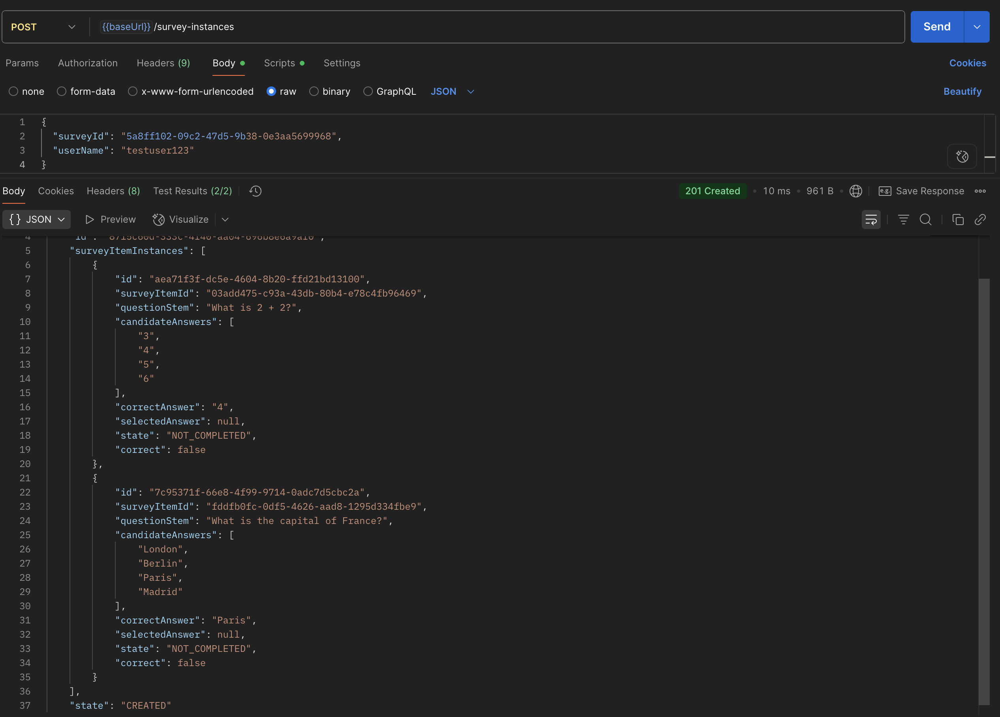

# Quick Postman Testing Guide

## Step 1: Import Collection

1. Open Postman
2. Click "Import" (top left)
3. Select file: `SurveyAPI_Tests.postman_collection.json`
4. Click "Import"

## Step 2: Set Environment

1. Click gear icon ⚙️ (top right)
2. Add environment: Name it "Local API"
3. Add variable:
   - Variable: `baseUrl`
   - Value: `http://localhost:8080/api`
4. Save and select this environment

## Step 3: Start Your API

```bash
cd labRest_act2
mvn spring-boot:run
```

## Step 4: Test Requirements

1. Click any api request in left navbar
2. click send button
3. you will see a response at bottom

#### Passing testcase expected

- API 1: POST 1. Create Survey Item - PASS

  1. Click: `POST 1. Create Survey Item - PASS`
  2. Click "Send"
  3. Expected :
     Expected : Status 201 Created
     

- API 2: Create Survey
  

- API 3: Add Survey Item to Survey

1. Get Survey ID: Run `GET All Surveys` → Copy a survey ID with `"state": "CREATED"`
2. Update API 3 Request:
   - replace this {{baseUrl}}/surveys/7d4f5589-d87b-48fe-8e48-56bb72e97cf2/items and press send button
     
     Note : we can see two item ids now first it was only 1 item ID

- API 4: Get All Surveys
  

- API 5 Get Specific Survey
  

  1. Get Survey ID: Use any survey ID from your previous `GET All Surveys` response

  2. Replace `{id}` with your survey ID:
     ```
     {{baseUrl}}/surveys/7d4f5589-d87b-48fe-8e48-56bb72e97cf2
     ```
  3. send button press

- API 6: Create Survey Instance

  1. Ensure Survey is COMPLETED:

  - Use a survey with `"state": "COMPLETED"` (like Math)
  - Survey ID: `5a8ff102-09c2-47d5-9b38-0e3aa5699968`

  2. Update API 6 Request Body:

     ```json
     {
       "surveyId": "5a8ff102-09c2-47d5-9b38-0e3aa5699968",
       "userName": "testuser123"
     }
     ```

  3. Click "Send"
     

- API 7: Accept Answer

  1. Update API 7 URL
     ```json
         {{baseUrl}}/survey-instances/0b242620-2d64-4b33-a39b-45cf1d17014b/answers
     ```
  2. Body (choose any one item ) after it hit send

     ````json{
         "itemInstanceId": "5d3d4b27-01b6-418e-b603-39af7349a4d7",
         "answer": "4"
     }```

     
     ````

- API 8: Get Survey Instances by State

  Test 1: Get All Instances

  1. Click `GET 8. Get Survey Instances by State`
  2. URL `{{baseUrl}}/survey-instances` (no parameters) --> send buttom

  Test 2: Filter by IN_PROGRESS
  URL `{{baseUrl}}/survey-instances?state=IN_PROGRESS`

  Test 3: Filter by CREATED
  URL `{{baseUrl}}/survey-instances?state=CREATED`

  Expected outcome?

  - All list of ALL surveys
  - IN_PROGRESS survey Only
  - CREATED instances still in CREATED state
  - try with complete if present
    

- API 9: Get Specific Survey Instance

  1. Click: `GET 9. Get Specific Survey Instance`
  2. URL: `{{baseUrl}}/survey-instances/0b242620-2d64-4b33-a39b-45cf1d17014b` send

  - all survey object with same items
    

- API 10: Delete Survey

  1. Click: `DELETE 10. Delete Survey`
  2. URL: `{{baseUrl}}/surveys/7d4f5589-d87b-48fe-8e48-56bb72e97cf2` send

  - you can verify it by get all survey

  ## Expected Result: here in image the status of the same id survey changed to deleted

  - `204 No Content`
    
    

### Failing test case expected s

## API 1: Create Survey Item - FAIL

Request:

```
POST {{baseUrl}}/survey-items


{
  "questionStem": "What is 2+2?",
  "candidateAnswers": ["3", "4"],
  // Missing correctAnswer field
}
```

Expected :

- Status: `400 Bad Request`
- Error message about missing required field

## API 2: Create Survey - FAIL

Test empty title:

Request:

```
POST {{baseUrl}}/surveys


{
  "title": ""
}
```

Expected :

- Status: `400 Bad Request`
- Error about invalid title

## API 3: Add Survey Item to Survey - FAIL

Request:

```
POST {{baseUrl}}/surveys/invalid-survey-id/items


{
  "surveyItemId": "any-item-id"
}
```

Expected :

- Status: `404 Not Found`
- Error: "Survey not found"

## API 3B: Add Survey Item to Survey - FAIL (Deleted Survey)

Request:

```
POST {{baseUrl}}/surveys/{DELETED_SURVEY_ID}/items

{
  "surveyItemId": "valid-item-id"
}
```

Expected :

- Status: `400 Bad Request`
- Error about modifying deleted survey

## API 4: Get All Surveys - FAIL (Invalid Endpoint)

Request:

```
GET {{baseUrl}}/survey
```

Expected :

- Status: `404 Not Found`
- Endpoint not found error

## API 5: Get Specific Survey - FAIL

Request:

```
GET {{baseUrl}}/surveys/non--id-12345
```

Expected :

- Status: `404 Not Found`
- Error: Survey not found

## API 6: Create Survey Instance - FAIL

Request:

```
POST {{baseUrl}}/survey-instances


{
  "surveyId": "SURVEY_ID_WITH_CREATED_STATE",
  "userName": "testuser"
}
```

Expected :

- Status: `400 Bad Request`
- Error: "Cannot create instance from non-completed survey"

## API 7: Submit Answer - FAIL

Test submitting answer to non-existent survey instance:

Request:

```
POST {{baseUrl}}/survey-instances/invalid-instance-id/answers


{
  "itemInstanceId": "any-item-instance-id",
  "answer": "some answer"
}
```

Expected :

- Status: `404 Not Found`
- Error: "Survey instance not found"

## API 8: Get Survey Instances by State - FAIL

Request:

```
GET {{baseUrl}}/survey-instances?state=INVALID_STATE
```

Expected :

- Status: `400 Bad Request`
- Error about invalid state value

## API 9: Get Specific Survey Instance - FAIL

Request:

```
GET {{baseUrl}}/survey-instances/non-existent-instance-id
```

Expected :

- Status: `404 Not Found`

## API 10: Delete Survey - FAIL

Request:

```
DELETE {{baseUrl}}/surveys/non-existent-survey-id
```

Expected:

- Status: `404 Not Found`
