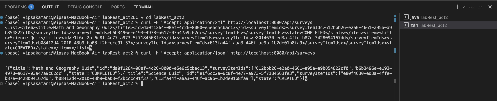

# Survey REST API - Quick Start Guide

## How to Run

### Step 1: Start the Application

```bash
cd labRest_act2
mvn spring-boot:run
```

Wait for the application to start (you'll see "Started SurveyApiApplication").

### Step 2: Open New Terminal

Open a second terminal in the same directory:

```bash
cd labRest_act2
```

### Step 3: Test the API

- Complete Postman Testing Guide - 20 Test Cases: See [PostmanApi.md](./PostmanApi.md)
  Note : if unable to connect with postman then try curl command in given documnetation. highly recommneded postman testing.
- [curlapi.md](./curlapi.md) for curl commands.
  Test with curl:
  ```bash
       curl http://localhost:8080/api/surveys
  ```
  Note : if the link is not working search for PostmanApi.md and curlapi.md docs.

## Extra credit API Documentation

Test these command for xml and json as well:
curl -H "Accept: application/xml" http://localhost:8080/api/surveys
curl -H "Accept: application/json" http://localhost:8080/api/surveys

View complete API documentation (used ):

```bash
cd labRest_act2
open apidoc/index.html
```

## Key IDs Used (Quick access to id for tetsing purposes):

| Resource               | ID                                     | Description                     |
| ---------------------- | -------------------------------------- | ------------------------------- |
| **Survey (CREATED)**   | `7d4f5589-d87b-48fe-8e48-56bb72e97cf2` | Geography Quiz - Test           |
| **Survey (COMPLETED)** | `5a8ff102-09c2-47d5-9b38-0e3aa5699968` | Math and Geography Quiz         |
| **Survey Item**        | `e2d0cdfd-f6e6-44bd-8674-90f9d959c0bf` | "What is the capital of Italy?" |
| **Survey Instance**    | `0b242620-2d64-4b33-a39b-45cf1d17014b` | Created from API 6              |
| **Item Instance**      | `5d3d4b27-01b6-418e-b603-39af7349a4d7` | Math question instance          |

## Base URL: `http://localhost:8080/api`

## Step 4: Get Bootstrap Data for Testing

**IMPORTANT:** Before running tests, get actual IDs:

```bash
# Get survey IDs
curl http://localhost:8080/api/surveys

# Get survey item IDs
curl http://localhost:8080/api/survey-items

# Get survey instance IDs
curl http://localhost:8080/api/survey-instances
```
